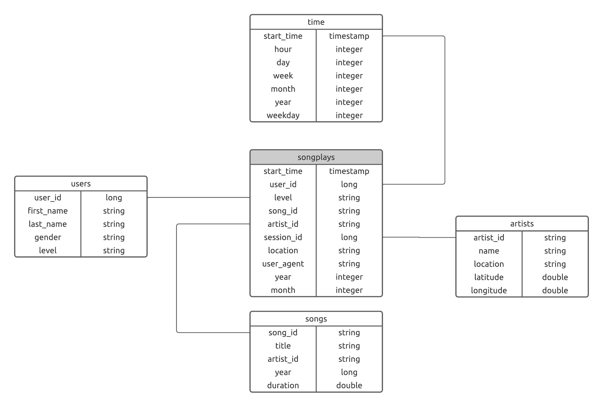

# Sparkify: Data Lake

This project is part of Udacity's **Data Engineering Nanodegree**.

## Description

This project is an ETL pipeline using Python that helps a fake startup called _Sparkify_ generate a data lake hosted
in S3 to satisfy their analytics team requirements. Their data resides in S3, in a directory of JSON logs on user 
activity on the app, as well as a directory with JSON metadata on the songs in their app.

This ETL obtains the data directly from S3, processes the data into analytics tables following a star schema using 
Spark, and loads them back into S3 as parquet files.

As the _Sparkify_ team is particularly interested in understanding what songs users are listening to, the data lake was 
designed to allow simple queries and fast aggregations on song reproductions.

## Schema Design

Due to the analytical purposes, the schema was designed to optimize reads and aggregations. More specifically, a 
[Star Schema](https://en.wikipedia.org/wiki/Star_schema) was utilized. 

The resulting schema was the following:



## ETL Pipeline

Raw data is as `json` files are located in AWS S3 buckets with the following endpoints:

* Song data: `s3://udacity-dend/song_data`
* Log data: `s3://udacity-dend/log_data`

The first step in the ETL process consists in ingesting at scale the `json` into a Spark cluster and then processing
the data into the five analytics tables described above.

Once the data is processed, it writen as parquet files in an S3 bucket specified by the user in the `dl.cfg` file (see
Setup section).

## Setup

### Python

Python 3.10.2 is recommended to execute the scripts of this project. The library dependencies (of the whole workspace) 
have been extracted to the file called `requirements.txt` and can be installed used the following command:

```
pip install -r requirements.txt
```

### Settings

To execute the code as-is, it is necessary to add a configuration file called `dl.cfg` at the root directory of the
repository. The following fields should be added to experience full functionality:

```
[IAM]
AWS_ACCESS_KEY_ID=<YOUR_AWS_ACCESS_KEY_ID_HERE>
AWS_SECRET_ACCESS_KEY=<YOUR_AWS_SECRET_ACCESS_KEY_HERE>

[S3]
SONG_DATA_PATH=s3a://udacity-dend/song_data/*/*/*/*.json
LOG_DATA_PATH=s3a://udacity-dend/log_data/*/*/*.json
OUTPUT_DATA_PATH=s3a://<YOUR_S3_BUCKET_NAME_HERE>/sparkify-dl/

[SPARK]
HADOOP_MODULE=org.apache.hadoop:hadoop-aws:<APPROPRIATE_VERSION>
```

If using Python 3.10.2 to execute the scripts,  Hadoop Module 3.3.1 will work fine. 

## Execution

In order to create the data lake clone this repo and once you have fulfilled the requirements detailed above run the 
following command:

```
python etl.py
```

## Project Structure

```
├── img                                        <- Images used in README.md
├── .gitignore                                 <- gitignore file
├── dl.cfg                                     <- Configuration file (NEEDS TO BE ADDED BY THE USER!)
├── etl.py                                     <- Python script responsible for ETL process
├── lake_schemas.py                            <- Python script with constants for ETL process
├── README.md                                  <- The top-level README for developers using this project.
└── requirements.txt                           <- Library dependencies needed for the pipeline
```